# Savio Story Engine

Astro-first scrollytelling framework. Authors describe **narrative intent**; the pipeline resolves presentation, motion, and transitions.

**Demo:** `/story/sample` · **Sample data:** [`stories/sample.ts`](stories/sample.ts)

---

## Pipeline

```mermaid
flowchart LR
  author["AuthorStory"] --> normalize["normalize()"]
  normalize --> model["StoryModel"]
  model --> director["direct()"]
  director --> directed["DirectedStoryModel"]
  directed --> theme["applyTheme()"]
  theme --> tokens["DesignTokens"]
  tokens --> plan["RenderPlan"]
  plan --> renderer["Story.astro"]
  renderer --> html["HTML"]
```



| Stage | Owns | Must not know |
| --- | --- | --- |
| **AuthorStory** | Content, scenes, optional `intent` / `presentation` | CSS, HTML, pair tables |
| **normalize()** | IDs, media coerce, defaults, lookahead | Director, theme |
| **direct()** | Adjacency choreography (`DirectorPlan`) | Colors, fonts, components |
| **Theme** | Tokens, motion mapping, style set | Where the story came from |
| **DesignTokens** | Concrete visual values (`headline.hero`, `spacing.block`, …) | Block semantics |
| **RenderPlan** | Layout attrs, motion names, css vars | Author field names |
| **Renderer** | HTML from plan + theme components | Story pair rules |

The renderer never understands story semantics. It paints a `RenderPlan`.

---

## Quick start

```ts
// stories/my-story.ts
import type { AuthorStory } from '../types';

const story: AuthorStory = {
  meta: { title: 'My Story' },
  scenes: [
    {
      title: 'Opening',
      slug: 'opening',
      blocks: [
        {
          type: 'hero',
          title: 'The Problem',
          subtitle: 'Bullying evolved.',
          background: '/images/st-dominic-savio.png',
        },
        {
          type: 'narrative',
          text: '…',
        },
      ],
    },
  ],
};

export default story;
```

```astro
---
import Base from '../../layouts/Base.astro';
import Story from '../../story/Story.astro';
import story from '../../story/stories/my-story';
---
<Base title="My Story">
  <Story story={story} theme="default" />
</Base>
```

---

## Authoring model

### Story → Scenes → Blocks

```ts
type AuthorStory = {
  meta?: { title?: string; description?: string };
  scenes: AuthorScene[]; // required, explicit
};

type AuthorScene = {
  title?: string;
  slug?: string;
  blocks: AuthorBlock[];
};
```

Scenes carry `id` / `slug` / `title` for future progress, nav, and analytics. They do not change block APIs.

### Content vs intent vs presentation

| Layer | Examples | Who decides |
| --- | --- | --- |
| **Content** | `title`, `quote`, `image`, `number`, `button` | Author |
| **Intent** | `emphasis`, `pace`, `mood`, `focus` | Author (optional); theme interprets |
| **Presentation** | `alignment`, `overlay`, `layout`, `width`, `effects` | Engine infers; author may override |

Prefer omitting presentation. Examples of inference:

- Hero with media → `overlay: 'dark'`
- Photo before quote/narrative → `layout: 'fullscreen'`
- Narrative → `width: 'narrow'`
- Text blocks (`narrative`, `quote`, `chapter`, `statistic`, `cta`) → `alignment` alternates `left` / `right`; theme adds `drift` toward center. Opt out with `presentation: { alignment: 'center' }`. Hero defaults to `center`.

Escape hatch:

```ts
{
  type: 'narrative',
  text: '…',
  presentation: { alignment: 'center' }, // stay centered, no drift
}
```

```ts
{
  type: 'photo',
  image: '/x.jpg',
  presentation: { layout: 'contained', effects: ['fade'] },
}
```

### Block types (v1)

`hero` · `narrative` · `quote` · `photo` · `statistic` · `chapter` · `cta`

No new types in this architecture pass — extend via the same content/intent/presentation shape.

### Media model

```ts
type StoryMedia = {
  kind: 'image'; // video | illustration | animation later
  src: string;
  alt?: string;
  focalPoint?: { x: number; y: number };
  treatment?: 'none' | 'cover' | 'contain';
  credits?: string;
};
```

Authors may pass a string URL; `normalize()` coerces to `StoryMedia`.

---

## Director

[`director/strategy.ts`](director/strategy.ts) — `resolve(previous, current, next)` returns:

```ts
type DirectorPlan = {
  transition: 'none' | 'pin-over' | 'crossfade' | 'stack';
  pacing: 'hold' | 'flow' | 'cut';
  overlap: number;
  pinning: boolean;
  emphasis: 'low' | 'medium' | 'high';
  surface: 'inherit' | 'paper' | 'ink' | 'media' | 'gradient';
};
```

Default pairs (same visual choreography as before):

| Pair | Transition |
| --- | --- |
| hero → narrative | pin-over |
| photo → quote / narrative | pin-over |
| statistic → chapter | crossfade |
| narrative / quote → chapter | stack |

Add pairs in `PAIR_PLANS`. Do not special-case pairs in Astro components.

---

## Design tokens

Themes supply a full [`DesignTokens`](tokens/types.ts) object. `tokensToCssVars()` emits `--token-*` on the story root. Blocks/CSS reference tokens only:

| Token group | Examples |
| --- | --- |
| `color.*` | ink, paper, accent, onMedia |
| `surface.*` | primary, secondary, inverse, gradient |
| `headline.*` | hero, section, pullquote, statistic |
| `body.*` | prose, caption, label |
| `spacing.*` | block, chapter, inline, large |
| `measure.*` | narrow, wide, hero, page |
| `motion.*` | gentle, emphatic, parallax, zoom |
| `shadow.*` | soft |
| `layout.*` | pinHeight, pinPullUp, viewport |

**Rule:** blocks ask for `headline.hero` / `spacing.section` / `surface.primary` — never raw `72px` or `#faf8f2`.

Alternate themes later = new token values (+ optional components), same `StoryModel`.

---

## Theme API

```
themes/
  types.ts
  registry.ts
  default/
    index.ts      # Theme registration
    tokens.ts     # DesignTokens values
    motion.ts     # intent/type → EffectName[]
```

```ts
type Theme = {
  id: StoryTheme;
  tokens: DesignTokens;
  styleIds: Array<'shell' | 'blocks' | 'effects' | 'transitions'>;
  resolveMotion(block: DirectedBlockModel): EffectName[];
};
```

Default theme maps types/intent → `fade` | `reveal` | `parallax` | `zoom` | `drift` (implementation detail). `presentation.effects` wins when set. `drift` is applied to side-aligned text blocks (horizontal settle toward center).

Component dispatch for the default theme lives in [`Section.astro`](Section.astro). Future themes can swap that map without changing stories.

---

## Directory map

```
story/
  Story.astro                 # buildRenderPlan → HTML
  Section.astro               # plan section → block component
  types.ts                    # AuthorStory (public)
  model.ts                    # StoryModel / RenderPlan IR
  media.ts
  tokens/                     # DesignTokens contract + css vars
  pipeline/
    normalize.ts
    direct.ts
    applyTheme.ts
    buildRenderPlan.ts
  director/
    strategy.ts
  themes/
    default/
  blocks/                     # default theme block markup
  effects/                    # low-level motion classes + client.ts
  styles/                     # token-consuming CSS
  stories/sample.ts
```

---

## Effects (implementation layer)

Effects are **not** author vocabulary (except override). Theme motion resolves them; CSS in `styles/effects.css` animates via `data-effect` + `.story-effect-*` classes. Side-aligned sections also set `data-align` so `drift` knows horizontal direction.

Viewport thirds (`cover` range): bottom third animates in, center holds, top third animates out. Heroes are enter-only (no exit) so pin-over sticky copy stays visible.

Client JS ([`effects/client.ts`](effects/client.ts)): statistic counters only.

---

## Source-agnostic IR

`StoryModel` is produced by `normalize(AuthorStory)` today. Future loaders (Markdown, YAML, JSON, AI) should emit the same `AuthorStory` or `StoryModel` — the renderer must never know the source.

---

## Extending

| Goal | Edit |
| --- | --- |
| New director pair | `director/strategy.ts` |
| New intent → motion | `themes/default/motion.ts` |
| New look (colors/type/space) | `themes/default/tokens.ts` |
| New theme | `themes/<name>/` + registry |
| New block type | `types.ts` → normalize → Section → `blocks/` → CSS |
| New token | `tokens/types.ts` + default tokens + `tokens/css.ts` + CSS usage |

---

## Agent brief

1. Author stories as `AuthorStory` with explicit `scenes[]` and content-first blocks.
2. Use `intent` for narrative emphasis; use `presentation` only when inference is wrong.
3. Prefer `string | StoryMedia` for images; do not invent per-block image field shapes.
4. Control cinema by **order** (director pairs) and intent — not custom HTML/CSS in story files.
5. Pin-over: `hero` then `narrative`, or fullscreen `photo` then `quote`/`narrative`.
6. Crossfade: `statistic` then `chapter`. Stack: `narrative`/`quote` then `chapter`.
7. Never hardcode colors/sizes in blocks — add/use design tokens.
8. Pipeline entry: `buildRenderPlan(story, theme)` from `pipeline/buildRenderPlan.ts`.
9. No new animation libraries. Verify with `npm run build` in `website/` (Node ≥ 22.12).
10. Reference: `stories/sample.ts` → `/story/sample`.
